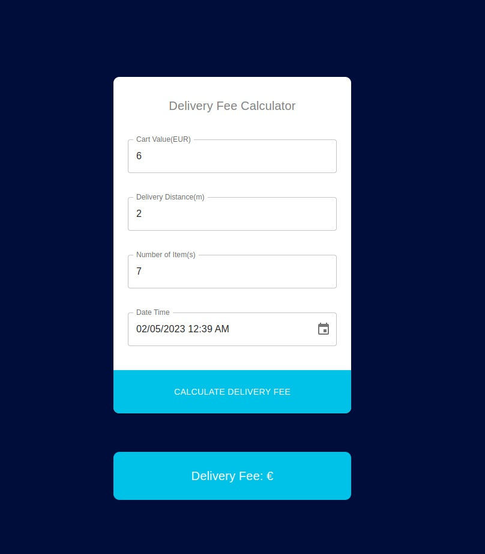

# Delivery Fee Calculator, Wolt Summer 2023 Engineering Internships

## Dependencies required to run the app.

* Need Node.js version 18.13.0 (Latest at the time of development)
* Need React version 18.2.0 (Latest at the time of development)
* Material UI version 5.11.0
* Formic
* Yup
* Dayjs
* vice versa..

## Available Scripts

In the project directory, you can run:

### `npm start`

Runs the app in the development mode.\
Open [http://localhost:3000](http://localhost:3000) to view it in the browser.

The page will reload if you make edits.\
You will also see any lint errors in the console.

### `npm test`

Launches the test runner in the interactive watch mode.\
See the section about [running tests](https://facebook.github.io/create-react-app/docs/running-tests) for more information.

### `npm run build`

**I did my best to develop a best product to show cause my skills and hard work.I implement all the requirements that Wolt Internships mention 😊** 

  

## Delivery fee calculator app have been created with the following pointers that very important:

* Code Reusibility
* Dynamic programming
* JSON data mapping
* Create a professional form that require minimum code length and need flexible to edit

### Specification
Rules for calculating a delivery fee
* If the cart value is less than 10€, a small order surcharge is added to the delivery price. The surcharge is the difference between the cart value and 10€. For example if the cart value is 8.90€, the surcharge will be 1.10€.
* A delivery fee for the first 1000 meters (=1km) is 2€. If the delivery distance is longer than that, 1€ is added for every additional 500 meters that the courier needs to travel before reaching the destination. Even if the distance would be shorter than 500 meters, the minimum fee is always 1€.
  * Example 1: If the delivery distance is 1499 meters, the delivery fee is: 2€ base fee + 1€ for the additional 500 m => 3€
  * Example 2: If the delivery distance is 1500 meters, the delivery fee is: 2€ base fee + 1€ for the additional 500 m => 3€
  * Example 3: If the delivery distance is 1501 meters, the delivery fee is: 2€ base fee + 1€ for the first 500 m + 1€ for the second 500 m => 4€
* If the number of items is five or more, an additional 50 cent surcharge is added for each item above and including the fifth item. An extra "bulk" fee applies for more than 12 items of 1,20€
  * Example 1: If the number of items is 4, no extra surcharge
  * Example 2: If the number of items is 5, 50 cents surcharge is added
  * Example 3: If the number of items is 10, 3€ surcharge (6 x 50 cents) is added
  * Example 4: If the number of items is 13, 5,70€ surcharge is added ((9 * 50 cents) + 1,20€)
* The delivery fee can __never__ be more than 15€, including possible surcharges.
* The delivery is free (0€) when the cart value is equal or more than 100€. 
* During the Friday rush (3 - 7 PM UTC), the delivery fee (the total fee including possible surcharges) will be multiplied by 1.2x. However, the fee still cannot be more than the max (15€).